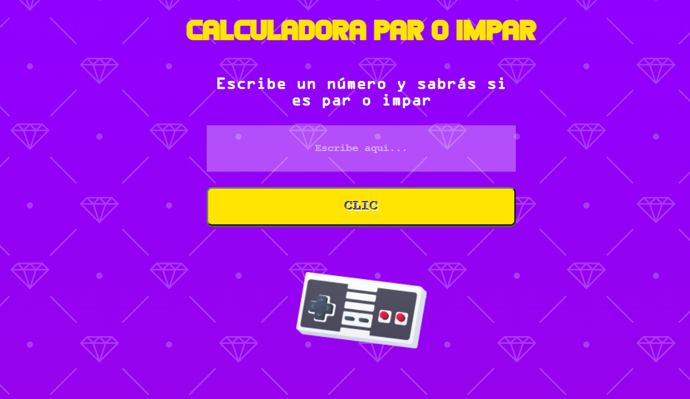
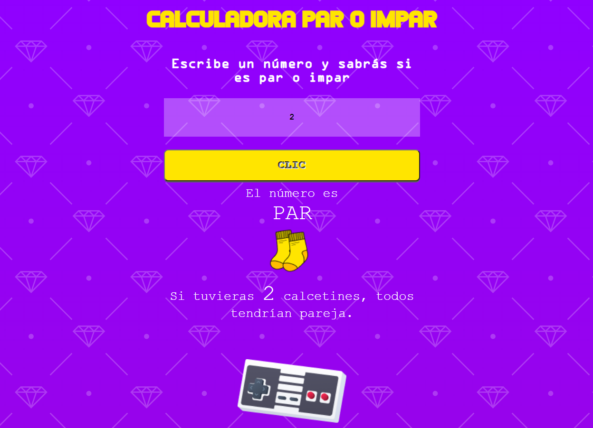

# Calculadora par/impar 🎮
# Programación, matemáticas visuales y UX writing

## Objetivo
#### Cuando se empieza a aprender programación, se suelen hacer ejercicios de matemática para poder trabajar con variables y datos 👨‍💻. Sin embargo, lo que suele pasar es que la programación va por un lado y todo lo "visual" va por otro 😥 O mostrás un resultado en consola, cumpliendo lo esperable en el algoritmo de programación, o lo dejas bonito... Pero ambas, difícil verlas unidas en una formación.
#### Este ejercicio colaborativo es una versión posterior a la calculadora par-impar realizada con formato de  **[Consola Gameboy vintage](https://playtechgo.com/tech/consola-gameboy/)** 💫 Queríamos usar esta "simple" fórmula pero agregando escritura y elementos gráficos para que se entienda mejor tanto el resultado como la lógica de programación que está por detrás ✨. 
#### En esta versión, no solo afinamos la variedad de alternativas que puede generar un algoritmo matemático, sino que mejoramos el proceso de usabilidad de un pequeño producto digital desde una perspectiva UXUI, que llame la atención a la persona usuaria, que les resulte sencillo, fácil y les intrigue a probarlo💖. 
### ¿Te gustaría saber si un número es par o impar de una forma más linda, divertida y gráfica?

#### Probalo en el siguiente link ⬇⬇⬇⬇⬇⬇

<a href="https://playtechgo.com/tech/calculadora-par-impar/">Calculadora par-impar mágica</a>

Así se ve el inicio del programa:

Y este es el resultado que muestra tras una consulta. No solo brinda información, sino que también la representa con dibujos 🎨 -ilustrados y editados por nosotres-.

### Realizado con 💖 por <a href="https://www.linkedin.com/in/dianaledist/">Diana Leonor Di Stefano</a> y <a href="https://www.linkedin.com/in/saul-roldan">Saúl Roldán Yusta</a>

### **[disatechgo](https://disatechgo.com/)**

### **[playtechgo](https://playtechgo.com/)**

### <a href="mailto:disatechgo@gmail.com">disatechgo@gmail.com</a>
